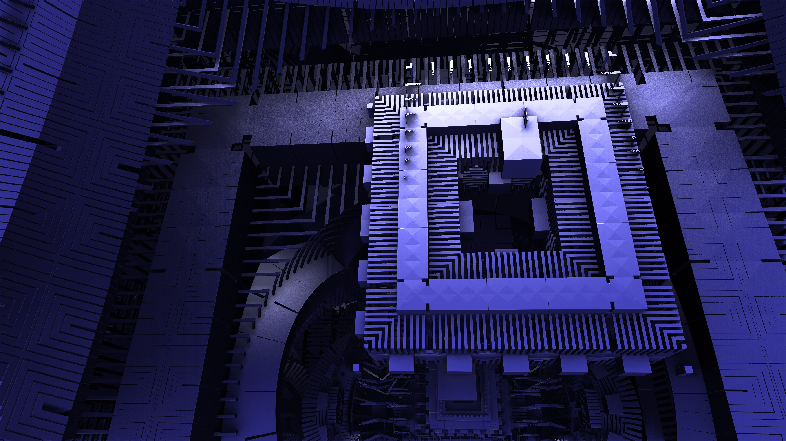

# Quantum Experiments

I want to contribute something back to society. Researching potentially breakthrough technologies, such as quantum computing, allows me to find how to practically make an impact.

## Usage

You'll need to sign up for an [IBM Quantum Experience](https://quantum-computing.ibm.com/) account because only a quantum computer (which you don't own) can run a quantum program. After that, you can use the [circuit composer](https://quantum-computing.ibm.com/composer) to run the programs saved in this repository's `src` directory.

## Contributing

Create a directory (e.g., `Half adder`) under `src/`. In this directory, save the QASM program as `program.qasm` and the circuit's image as `circuit.png`.

## License

This project is under the [MIT License](LICENSE).